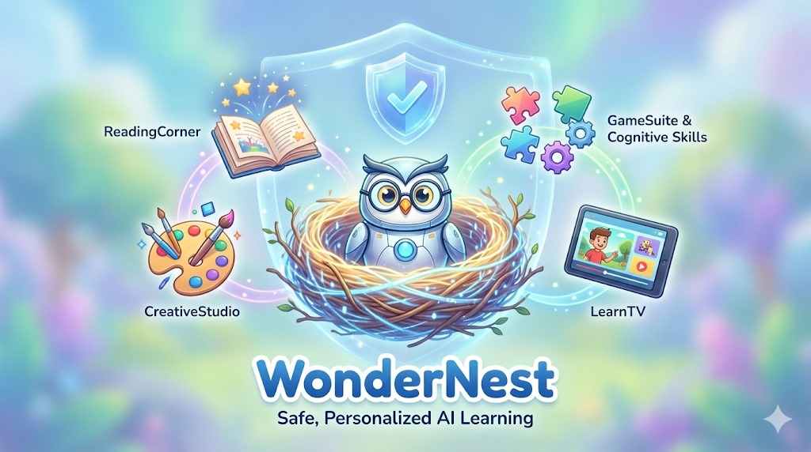

# KidOS – WonderFeed

A **kid-safe, AI-powered learning website** for children (ages 2–7): discovery feed, stories, LearnTV, creative games, and **Professor Hoot** – all with optional behavior-based adaptation (IBLM).



## What it does

- **Home / Feed** – Daily facts cards and a story library (AI-generated books with illustrations).
- **LearnTV** – Short educational “shows”: pick a topic, get a script + images + voiceover that plays in sync.
- **Games** – Magic Paint (AI describes your drawing), Safari Speech (pronunciation), Memory Zoo (card matching).
- **Ask Hoot** – Chat with Professor Hoot; short, simple answers and optional images.
- **Parents** – PIN-gated area: fact checker (search-grounded summaries) and activity insights.
- **IBLM** – Optional adaptation: calming mode when frustration is high, short-burst content when attention is low (debug HUD: `?iblm=1`).

## Tech

- **React 19**, **Vite**, **Tailwind CSS**
- **Google Gemini** (text, image, TTS, optional search grounding)
- **Local-first** – Child/parent data in browser storage unless you add sync

## Run locally

**Prerequisites:** Node.js (e.g. 18+).

```bash
git clone https://github.com/ridhamjain28/kidos.git
cd kidos
npm install
```

1. **API key (optional)** – Create `.env.local` and set `GEMINI_API_KEY=your_key` for AI features.
2. **Intro video** – Keep `WonderNest.mp4` in the project root; `npm run dev` copies it to `public/` and it’s used as the welcome intro (with a Skip button).
3. **Run the site:**
   ```bash
   npm run dev
   ```
   Open **http://localhost:3000** in your browser.

## Build for production

```bash
npm run build
npm run preview
```

Use the `dist/` output with any static host (e.g. Vercel, Netlify, GitHub Pages).

## Deploy as a website

- Build: `npm run build`
- Serve the `dist` folder from your host’s root (or set the host’s “public directory” to `dist`).
- Ensure routes fall back to `index.html` (SPA) if you use client-side routing later.

The app is set up as a proper website: meta tags, theme color, Open Graph, favicon, and a web app manifest for “Add to Home Screen” and sharing.

## Repository

- **GitHub:** [ridhamjain28/kidos](https://github.com/ridhamjain28/kidos)
- **AI Studio:** [View app in AI Studio](https://ai.studio/apps/drive/1MoVAPk6BDgtcZMl1E2jJlcQEx-VCgcMx)

## License

Private / unlicensed unless otherwise specified.
